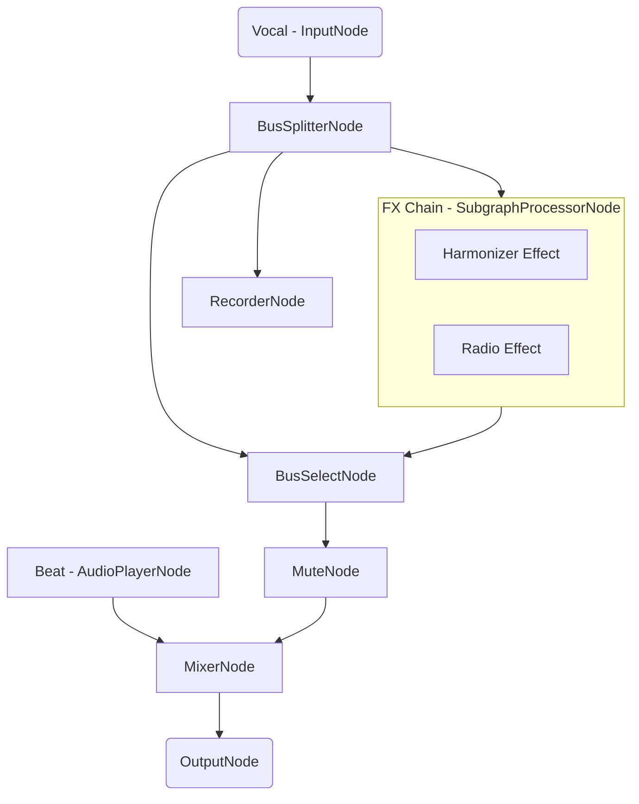
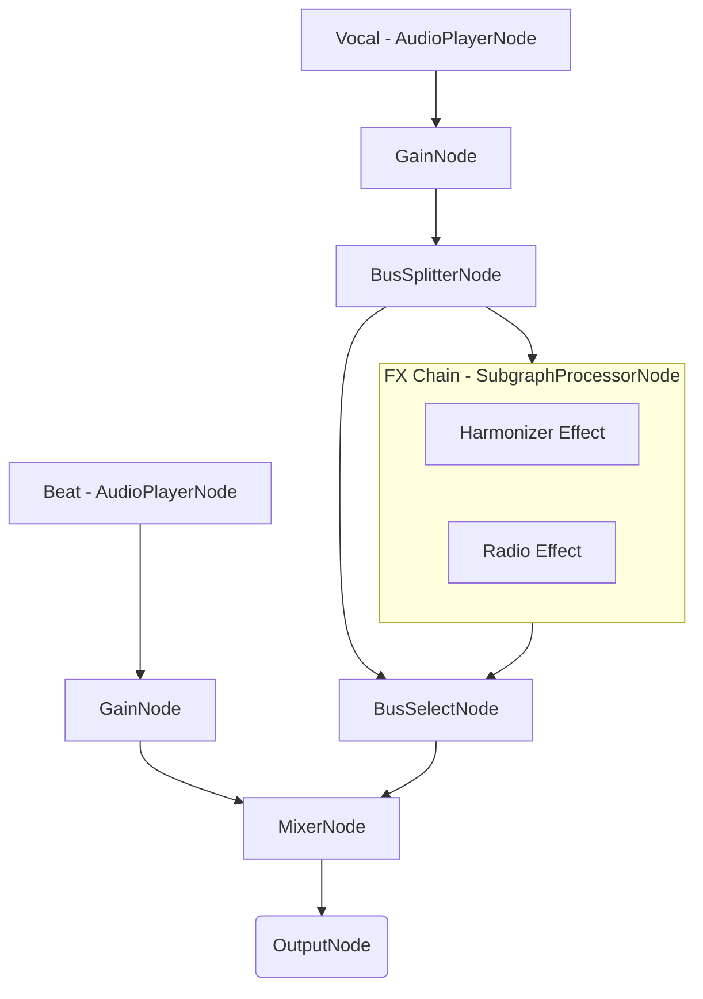
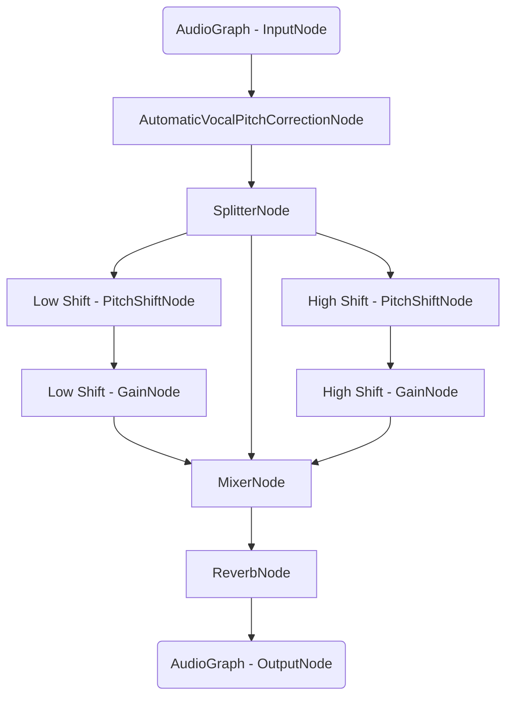
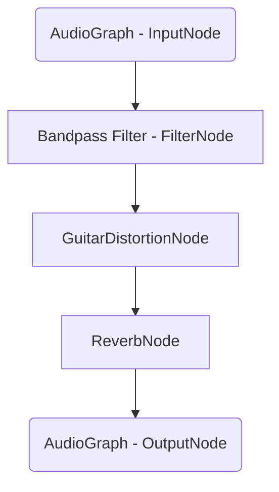

# Vocal FX Chains App - iOS

## Important Links

<a href="https://docs.switchboard.audio/docs/examples/vocal-fx-chains/" target="_blank">Find more info on the Vocal FX Chains App HERE</a>

<a href="https://docs.switchboard.audio/" target="_blank">Find more info on the Switchboard SDK HERE</a>

## About Vocal FX Chains

*A very important use case for audio processing is making vocal performances more interesting by applying various effects.*

*Using our basic effects as building blocks we can make complex FX chains with full control over the parameters.*

*Such FX chains can be applied after making the recording, but the low latency capabilities of the SDK allows us to apply the effects real-time, while recording.*

*In this example we will create an app for voice recording over a beat with real-time and post-production FX chains for the vocals, and sharing capabilities for the end result.*

## Features

The app has the following **features**:

- Vocal recording over a beat
- Ability to apply FX chains during recording
- Ability to replace FX chains after recording
- Customization of FX chain presets
- Sharing of the completed recording

It consists of the following **screens**:

- ***Recording:*** Vocal recording over a beat, FX chain enabling and selection
- ***FX Editing:*** Post-production FX chain selection and parametrization for the recording, and an export and share capability

We will implement two kinds of FX Chains, a ***Harmonizer Effect*** and a ***Radio Effect***. More info on those below the screens.

### Recording

The recording screen consists of a recording start and stop button, and an FX chain selection control and enabling button.

After starting the recording the beat playback starts, which you can hear through the speaker. The audio system saves the clean vocal recording separately to be able to render with different FX chains in a later step.

If using headphones you are able to monitor your own voice real time with the selected FX chain applied.

#### Audio System

Our audio system for vocal recording has to be able to record a clean input, while on a separate branch applying the effects and mixing it with the beat track. The output of the mixer is routed to the speakers.

The audio graph for the Recording screen looks the following:

#### Audio Graph

To run our FX chains we utilize a `SubgraphProcessorNode` in which we pass our FX audio graphs. This node is plugged in between the recorded voice player and the final mixer of our Karaoke App. `SubgraphProcessorNode` is capable of hot-plugging different audio graphs while running in real time, enabling us to switch between the different FX chains.

### FX Editing

The FX editing screen consists of an FX chain selection control and the controls for the various FX parameters.

When selecting a new FX chain the previously saved clean vocals are rendered to the output with the new FX chain so you can hear the changes instantly.

The sharing feature allows you to select whether you want to save or share your completed recording to the usual channels.

<Screenshot src="/img/vocal-fx-chains-app-fxediting-screen.png" width="320" />

The audio graph for the FX Editing screen looks the following:

#### Audio Graph

The same audio graph will be used with the **Offline Graph Renderer** to render the final mix to an output file which can be shared.

## FX Chains

We implement our FX chains as separate audio graphs. These graphs can be run by passing it to a `SubgraphProcessorNode`.
The different effect nodes can be chained inside this subgraph.

### Harmonizer Effect

This effect utilizes an automatic vocal pitch correction node to correct the pitch. The signal is split after the automatic vocal pitch correction pitch shifted by 4 notes in both directions to emulate harmonizing. It adds some reverb after mixing the pitch shifted outputs with the pitch corrected signal.

#### Audio Graph

### Radio Effect

This effect first bandpass filters the signal to only keep frequencies around the 3648 Hz value, discarding bass and treble, then applies some distortion to it. This emulates an analog radio-like sound. At the end some reverb is applied to make it a bit richer.

#### Audio Graph

## Important Links

<a href="https://docs.switchboard.audio/docs/examples/vocal-fx-chains/" target="_blank">Find more info on the Vocal FX Chains App HERE</a>

<a href="https://docs.switchboard.audio/" target="_blank">Find more info on the Switchboard SDK HERE</a>
